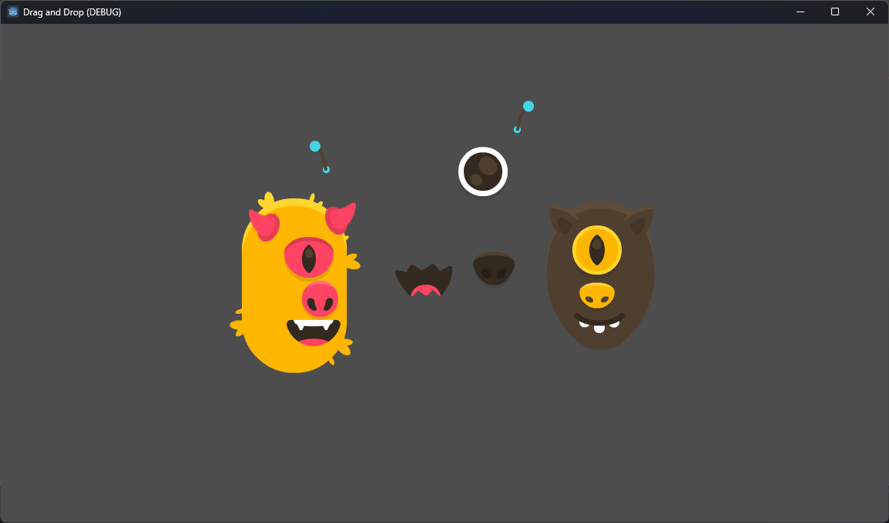

# Draggable Control Addon for Godot

A lightweight, reusable Godot script for creating draggable UI elements with ease. This addon is ideal for adding drag-and-drop functionality to your Godot projects.

_Made with [Godot Engine](https://godotengine.org) v4.3_

## Demo Preview
Enjoy a demo where you can create your Kenney Monster as you want by dragging the monster parts to it.


## Features

- **Drag-and-Drop Support:** Easily add drag-and-drop behavior to `Control` nodes.
- **Signals:** Built-in signals for `dragged` and `dropped` events.
- **Configurable Behavior:** Option to reset position after dragging using the `drop_to_origin` property.
- **Hover Detection:** Detect when the mouse pointer is over the control.
- **Customizable Z-Index:** Automatically adjusts the z-index while dragging to ensure visibility.

## Installation

1. Copy the `draggable_control.gd` script into your project.
2. Attach the script to any `Control` node you want to make draggable.

## Usage

1. **Attach the Script:**
   Attach `draggable_control.gd` to a `Control` node (e.g., Button, TextureRect).

2. **Enable Dragging:**
   Configure the `drop_to_origin` property to control whether the node returns to its original position after being dropped:
   ```gdscript
   $DraggableNode.drop_to_origin = true
   ```

3. **Connect Signals:**
   Use the `dragged` and `dropped` signals to respond to drag-and-drop events:
   ```gdscript
   func _on_dragged():
       print("Dragging started!")

   func _on_dropped():
       print("Dragging ended!")

   $DraggableNode.dragged.connect(_on_dragged)
   $DraggableNode.dropped.connect(_on_dropped)
   ```

## API

### Properties

- **`drop_to_origin : bool`**
  - When `true`, the node will return to its last position before dragging.
  - Default: `true`

- **`dragging : bool`** (read-only)
  - Indicates whether the node is currently being dragged.

- **`hover : bool`** (read-only)
  - Indicates whether the mouse pointer is inside the control node.

### Signals

- **`dragged`**: Emitted when dragging starts.
- **`dropped`**: Emitted when dragging ends.

## Example

Here's a simple example of how to use the Draggable Control:

```gdscript
extends Control

func _ready():
	var draggable = DraggableControl.new()
	draggable.drop_to_origin = false
	draggable.dragged.connect(on_dragged)
	draggable.dropped.connect(on_dropped)
	add_child(draggable)
	
	var icon = TextureRect.new()
	icon.texture = load("res://icon.svg")
	draggable.add_child(icon)

func on_dragged():
	print("Node is being dragged!")

func on_dropped():
	print("Node was dropped!")
```

## License

This addon is licensed under the MIT License. Feel free to use, modify, and distribute it in your projects.

## Contributions

Contributions, suggestions, and bug reports are welcome! Please feel free to open an issue or submit a pull request on the [GitHub repository](#).

---

Add this script to your repository and start building interactive drag-and-drop experiences in your Godot projects!

